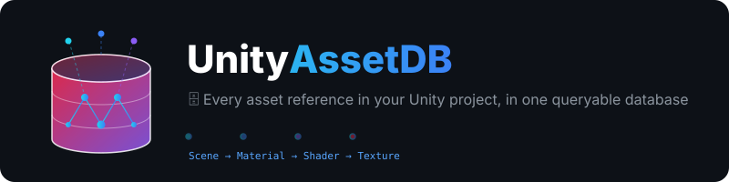
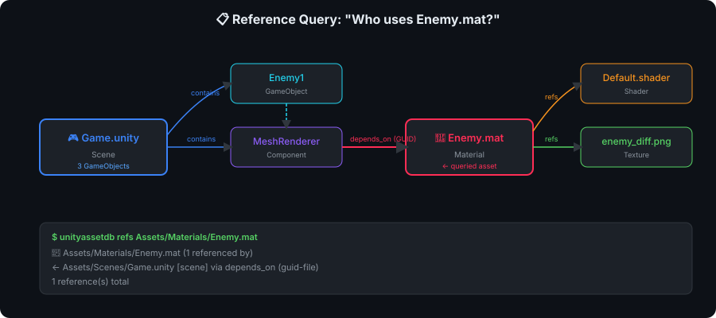
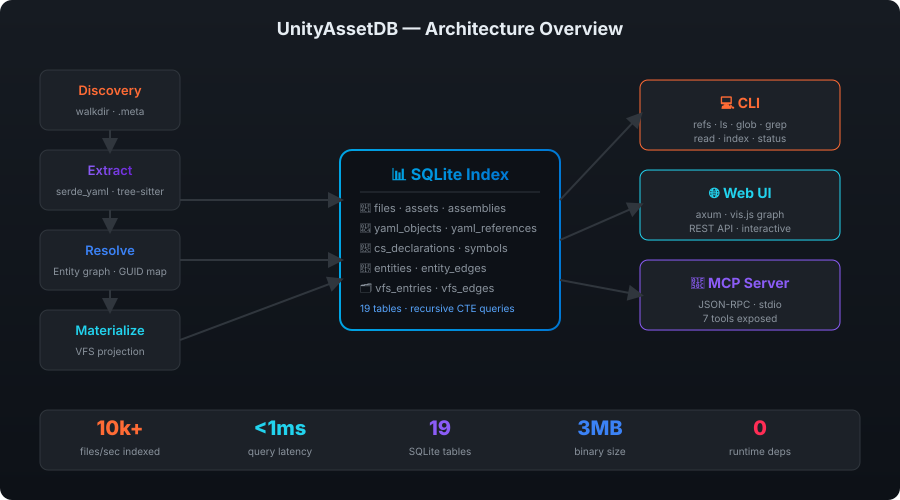

<p align="center">
  
</p>

<p align="center">
  <strong>🗄️ Every asset reference in your Unity project, in one queryable database</strong>
</p>

<p align="center">
  <a href="https://github.com/song-chaoyang/UnityAssetDB/actions/workflows/ci.yml"></a>
  <a href="https://github.com/song-chaoyang/UnityAssetDB/actions/workflows/release.yml"></a>
  
  
  <a href="LICENSE"></a>
  <a href="README.zh-CN.md">🌐 中文</a>
</p>

---

## Why UnityAssetDB?

Unity projects grow into tangled webs of asset dependencies. **"Who references this material?" "Is this texture safe to delete?" "Which scenes use this prefab?"** — answering these questions by hand means grepping through thousands of YAML files.

UnityAssetDB indexes your entire Unity project into a **SQLite database** and answers these questions in **under 1 millisecond**.

```
$ unityassetdb refs Assets/Materials/Enemy.mat

📂 Assets/Materials/Enemy.mat (2 referenced by)
────────────────────────────────────────────────────────────────
  ← Assets/Scenes/Game.unity [scene] via depends_on (guid-file)
  ← Assets/Scenes/Game.unity [scene] via instance_of
2 reference(s) total
```

### ✨ Key Features

| Feature | What it does |
|---------|-------------|
| 🔗 **Reference Tracking** | Trace any asset's incoming/outgoing dependencies via GUID resolution |
| 🌳 **Hierarchy Browser** | Navigate GameObject trees, component bindings, Transform parent/child |
| 🔬 **C# Script Analysis** | tree-sitter powered class/method extraction + MonoBehaviour binding |
| 📁 **Virtual File System** | Query assets as virtual paths with glob, grep, and tree listing |
| 🌐 **Interactive Web UI** | vis.js dependency graph, click-to-explore, REST API |
| 🔌 **MCP Server** | JSON-RPC over stdio — integrate with any MCP-compatible tool |
| ⚡ **Blazing Fast** | Rust + SQLite + rayon parallelism — 10,000+ files/sec |
| 📦 **Zero Dependencies** | Single static binary, no runtime needed |

---

## Quick Start

### Install

```bash
# Download pre-built binary (macOS / Linux / Windows)
# → https://github.com/song-chaoyang/UnityAssetDB/releases

# Or build from source
cargo install --git https://github.com/song-chaoyang/UnityAssetDB
```

### 3 Steps to Go

```bash
# 1️⃣  Index your Unity project
unityassetdb index build /path/to/your/unity/project

# 2️⃣  Query references
unityassetdb refs Assets/Materials/Enemy.mat -p /path/to/project

# 3️⃣  Launch the Web UI
unityassetdb serve /path/to/project --port 8089
```

### Live Progress Feedback

The 8-phase pipeline renders a live multi-bar display — weighted overall percentage + ETA, a phase bar with throughput and live extraction stats, and the file currently being processed:

```
⠸ [00:00:12] ████████████░░░░░░░░  48% 3/8 extract · ETA 08s
⠹ ████████████████░░░░░  extract 31,422/54,120 · 2,615/s · 892K objs · 1.2M refs · 2.3 GB
  📄 Assets/Scenes/MainMenu.unity
```

When it finishes, you get a per-phase timing breakdown so you always know where the time went:

```
  phase breakdown:
    scan          1.8s  ████████████████████
    register      0.6s  ██████
    extract      14.2s  ████████████████████████████
    assets        0.9s  ██
    graph         2.7s  █████
    bind          0.4s  █
    vfs           1.1s  ██
    publish       0.2s
✅ Index built in 21.4s: .unityassetdb/index.db (54,120 files, 12,830 assets, 8,221 scripts bound, 2,529 files/s)
```

### Demo: Reference Query

<p align="center">
  
</p>

---

## CLI Reference

```
unityassetdb <COMMAND>

Commands:
  index   Index management (build / sync / status)
  refs    Query the reference graph for a VFS path
  ls      List VFS entries under a path
  glob    Find VFS entries matching a glob pattern
  grep    Search content within VFS entries
  read    Read content of a VFS entry
  serve   Start web server with interactive graph UI
  mcp     Start MCP server (JSON-RPC over stdio)
  help    Print this message
```

### Common Queries

```bash
# Who references this material? (incoming)
unityassetdb refs Assets/Materials/Enemy.mat -p /project

# What does this scene depend on? (outgoing)
unityassetdb refs Assets/Scenes/Game.unity -p /project --direction out

# Filter to file-level results only
unityassetdb refs Assets/Materials/Enemy.mat -p /project --filter File

# Browse the asset tree
unityassetdb ls Assets -p /project --depth 2

# Find all prefabs
unityassetdb glob "*.prefab" -p /project

# Search for a class name in indexed content
unityassetdb grep "PlayerController" -p /project

# View index statistics
unityassetdb index status /project
```

---

## Architecture

<p align="center">
  
</p>

### How It Works

UnityAssetDB runs a **7-stage indexing pipeline**:

| Stage | What happens |
|-------|-------------|
| 1. **Discovery** | Walk `Assets/`, `Packages/`, `ProjectSettings/` with `walkdir`. Parse `.meta` files for GUIDs. |
| 2. **Extract** | Parse Unity YAML (`.unity`, `.prefab`, `.mat`, `.asset`) with `serde_yaml`. Parse C# with `tree-sitter`. Extract objects, references, declarations. |
| 3. **Resolve** | Build entity graph: GameObject→Component edges, Transform hierarchy, prefab instance links, script-to-symbol bindings. |
| 4. **Materialize** | Project entities into a Virtual File System (VFS) with queryable paths and edges. |
| 5. **Finalize** | Integrity checks — verify no broken VFS edges. |
| 6. **Publish** | Atomic SQLite database swap-in. |
| 7. **Sync** | Incremental update — only re-index changed files based on content hash. |

### SQLite Schema — 19 Tables

| Layer | Tables | Purpose |
|-------|--------|---------|
| Files | `files`, `assemblies`, `assembly_references` | Track every file + .meta GUID |
| YAML | `yaml_objects`, `yaml_references` | Parsed Unity YAML structure + references |
| C# | `cs_declarations`, `cs_mentions`, `symbols`, `symbol_edges` | tree-sitter extracted code structure |
| Graph | `assets`, `entities`, `entity_edges`, `entity_symbol_edges` | Entity relationship graph |
| VFS | `vfs_entries`, `vfs_edges` | Virtual file system for querying |
| Meta | `projects`, `index_diagnostics`, `rebuild_summary` | Index metadata |

### VFS Edge Types

| Edge | Meaning |
|------|---------|
| `child_of` | Directory → file, parent → child |
| `defined_in` | Node → file where it's defined |
| `depends_on` | File → referenced file (via GUID) |
| `instance_of` | Prefab instance → source prefab |
| `binds_to` | Component → C# script class |
| `refs` | General reference edge |

---

## REST API

When running `serve`, these endpoints are available:

| Endpoint | Description |
|----------|-------------|
| `GET /api/status` | Index statistics (file count, asset count, etc.) |
| `GET /api/ls?path=...&depth=N` | List VFS children |
| `GET /api/refs?path=...&direction=in&filter=ALL` | Reference query |
| `GET /api/glob?pattern=...&entry_type=ALL` | Glob search |
| `GET /api/grep?pattern=...&path=...` | Content search |
| `GET /api/read?path=...` | Read VFS entry content |
| `GET /api/graph?path=...` | Subgraph for visualization (nodes + edges) |

---

## MCP Server

UnityAssetDB can run as an MCP (Model Context Protocol) server, exposing 7 tools via JSON-RPC over stdio.

```bash
unityassetdb mcp
```

### Configuration

Add to your MCP client config file (e.g. `claude_desktop_config.json`):

```json
{
  "mcpServers": {
    "unityassetdb": {
      "command": "/path/to/unityassetdb",
      "args": ["mcp"]
    }
  }
}
```

### Available Tools

| Tool | Description |
|------|-------------|
| `index_build` | Build a fresh index for a Unity project |
| `index_status` | Show index statistics |
| `refs` | Query reference graph (in/out, with filter) |
| `ls` | List VFS entries |
| `glob` | Glob pattern search |
| `grep` | Content search |
| `read` | Read VFS entry content |

---

## Supported File Types

| Extension | Kind | Parser |
|-----------|------|--------|
| `.unity`, `.scene` | Scene | Unity YAML |
| `.prefab` | Prefab | Unity YAML |
| `.mat` | Material | Unity YAML |
| `.asset` | ScriptableObject | Unity YAML |
| `.controller`, `.overrideController` | Animator | Unity YAML |
| `.anim` | Animation | Unity YAML |
| `.vfx` | Visual Effect | Unity YAML |
| `.cs` | C# Script | tree-sitter |
| `.asmdef`, `.asmref` | Assembly Definition | JSON |
| `.shader`, `.hlsl` | Shader | Text |
| `.fbx`, `.png`, `.wav`, ... | Binary | Hash only |

---

## Tech Stack

| Component | Technology | Why |
|-----------|-----------|-----|
| Language | **Rust** | Zero-cost abstractions, memory safety, single binary |
| Database | **rusqlite** (bundled) | Recursive CTE queries, WAL mode, zero-config |
| C# Parser | **tree-sitter** | Incremental parsing, AST extraction |
| YAML Parser | **serde_yaml** | Unity multi-document YAML support |
| Web Server | **axum** + **tokio** | Async, type-safe routing |
| Parallelism | **rayon** | Data-parallel file extraction |
| Graph UI | **vis.js** | Interactive network visualization |

---

## Benchmarks

Measured on a real Unity project (URP + TextMeshPro, Apple Silicon MacBook):

| Project Size | Files | Index Time | Throughput | DB Size |
|-------------|-------|-----------|------------|---------|
| Test fixture | 10 | <0.1s | — | 48 KB |
| Real project (Assets + PackageCache) | 12,969 | 13.6s | ~950 files/s | 185 MB |

> Indexing covers `Assets/`, `Packages/`, `ProjectSettings/` and `Library/PackageCache/` (built-in package scripts resolve too). Includes indexing file bodies for `grep`/`read`.

---

## Development

```bash
cargo test      # Run all 32 tests
cargo clippy    # Lint
cargo fmt       # Format
cargo bench    # Benchmarks
```

### Project Structure

```
src/
├── model/          # Data types (FileKind, AssetKind, EntityKind, EdgeKind)
├── discovery/      # File system scanning + .meta parsing
├── extract/         # Unity YAML + C# tree-sitter parsers
├── resolve/        # Entity graph construction + script binding
├── materialize/    # VFS projection
├── db/              # SQLite schema + connection management
├── query/           # refs, ls, glob, grep, read
├── cli/             # CLI + MCP command handlers
├── server/          # axum REST API
└── web/             # Embedded HTML/JS/CSS

tests/
├── fixtures/        # Minimal Unity test project
└── integration_test # 32 tests: unit + integration
```

---

## Download

Pre-built binaries available on the [Releases](https://github.com/song-chaoyang/UnityAssetDB/releases) page:

| Platform | Download |
|----------|----------|
| macOS (Apple Silicon) | `unityassetdb-aarch64-apple-darwin.tar.gz` |
| macOS (Intel) | `unityassetdb-x86_64-apple-darwin.tar.gz` |
| Linux (x86_64) | `unityassetdb-x86_64-unknown-linux-gnu.tar.gz` |
| Windows (x86_64) | `unityassetdb-x86_64-pc-windows-msvc.zip` |

---

## Contributing

Contributions are welcome! See [CONTRIBUTING.md](CONTRIBUTING.md) for guidelines.

## Star History

[](https://www.star-history.com/#song-chaoyang/UnityAssetDB&Date)

## License

[MIT](LICENSE) © 2026
